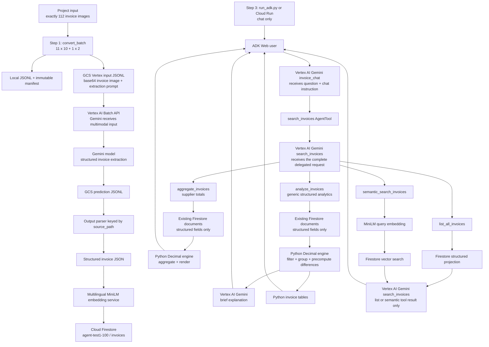
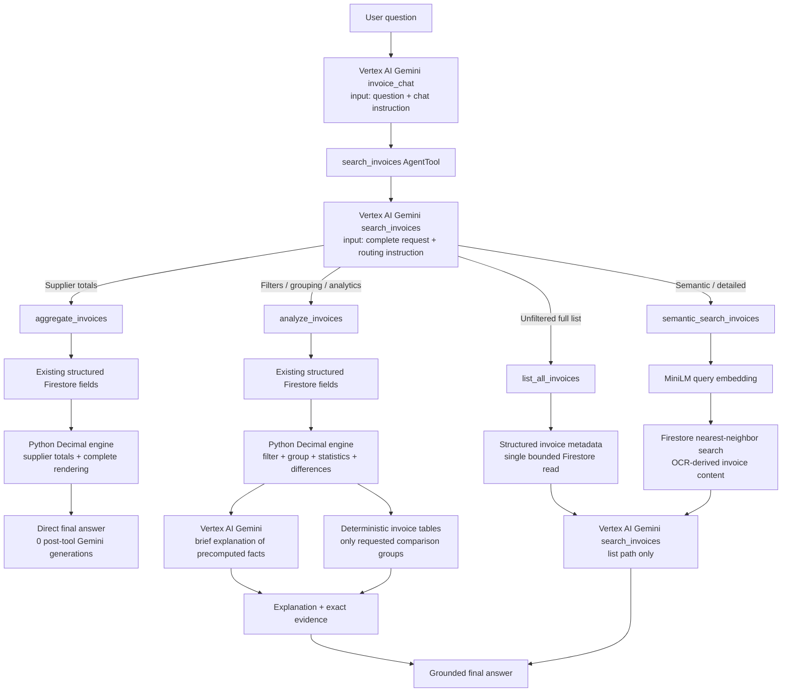

# Agent Ledger architecture

Author: Miguel Medina Cantos

The application layer coordinates use cases without importing concrete Google libraries. The
extractor, embedding service, and vector index are passed through typed ports, which makes the
pipeline testable without credentials. Production adapters load Google clients and the MiniLM
model lazily and cache each model/client once per process.

Batch preparation, batch indexing, and chat runtime are separate application boundaries.
`convert_batch` is the only component that reads the 112 project images and writes Vertex input
JSONL. It partitions the sorted input into eleven ten-image groups and one final two-image group,
each below a defensive 10 MiB raw-image ceiling, then uploads those files and publishes a local
manifest.

`index_batch_to_firestore` consumes that manifest, runs the 12 Vertex jobs sequentially, reads the
prediction JSONL from Cloud Storage, embeds structured extractions with MiniLM, and writes the
permanent Firestore RAG records. It is pinned to `agent-test1-100`. A preflight compares document
IDs, image hashes, extraction model, and embedding model before any job or model is constructed.
When all records are current, Vertex Batch, MiniLM, and Firestore writes are completely skipped.
Partial reruns preserve current documents and retry only missing or stale records.

`run_adk.py` is a chat-only process. It has no dependency on image discovery, the batch manifest,
or Cloud Storage output. The batch bucket is temporary ingestion transport; Firestore remains the
only persistent data source used by the agentic RAG during conversation.

## When Gemini receives input through Vertex AI

Gemini receives input through Vertex AI at two separate application boundaries:

1. **Multimodal extraction.** `index_batch_to_firestore` submits the GCS input JSONL URI to the
   Vertex AI Batch API. Vertex reads every JSONL request and passes Gemini one base64-encoded
   invoice image together with the extraction prompt. Gemini's structured response is written as
   prediction JSONL in Cloud Storage, parsed locally, embedded with MiniLM, and persisted in
   Firestore.
2. **Agentic chat.** For each user turn, ADK sends the question and `invoice_chat` instruction to
   Gemini through Vertex AI. If retrieval is needed, the root agent delegates the complete request
   to the `search_invoices` Gemini agent, also through Vertex AI. That agent chooses one Firestore
   branch. For `list_all_invoices` and `semantic_search_invoices`, the search Gemini receives the
   structured tool result and returns grounded evidence. `aggregate_invoices` remains completely
   deterministic. For `analyze_invoices`, Python calculates filters, groups, statistics,
   differences, and percentages, then sends only compact facts to a specialized Gemini child for
   a short explanation. Python appends requested invoice tables after that explanation, so Gemini
   never calculates figures or regenerates evidence rows.

During chat, Gemini never reads the original images or the batch bucket. Firestore data reaches
Gemini only as bounded search output or compact precomputed analytical facts.
Deterministic analytics use the same existing Firestore documents without migrations, writes, new
indexes, or reindexing.

Loguru measures preparation, upload/reuse, Firestore preflight, Vertex submission and state,
prediction parsing, MiniLM generation, Firestore upsert, each batch, remaining images, and total
elapsed time. The terminal stream is also persisted under `output/logs/`.

Chat retrieval has four mutually exclusive paths per user turn. Targeted questions embed the query
and perform one nearest-neighbor vector search. Unfiltered full-collection inspection uses
`list_all_invoices`. Supplier-total questions use `aggregate_invoices`. Other structured analytical
questions use `analyze_invoices`, whose controlled schema supports filters, grouping, count, sum,
average, minimum, maximum, HAVING-like thresholds, sorting, dynamic user-requested invoice counts,
and evidence. Every structured path omits embeddings, `search_text`, and OCR text.

## Agentic routing with deterministic analytics

The routing decision is agentic, but retrieval remains constrained to one branch per user turn.
`aggregate_invoices` preserves the fast audited supplier-total response, including all 112 evidence
rows when requested. `analyze_invoices` generalizes the same approach: a number such as 15 or 30 is
copied from the user's request into `requested_invoice_count`; it is never hardcoded. For example,
"30 invoices from the same month and year" becomes grouping by year/month, `count >= 30`, and an
evidence limit of 30, while "15 invoices from a specific date" becomes a date filter and an evidence
limit of 15. If a threshold has no match, Python reports the closest value and every tied group.

Explicit period comparisons use one `in` filter, so `Compare 2002 with 2009` cannot leak unrelated
years into the result. Python precomputes per-currency totals, counts, averages, minima, maxima,
absolute differences, and percentage changes. Gemini explains those facts, while Python appends
the invoice tables for only the requested periods.

`list_all_invoices` remains available for unfiltered inspection. `semantic_search_invoices` embeds a
targeted question and searches the OCR-derived Firestore vector index. The analytical tools project
only existing compact structured fields and use exact `Decimal` arithmetic. Their Markdown evidence
tables are generated in Python and forwarded through nested `AgentTool(skip_summarization=True)`
branches, so Gemini can explain compact facts without recalculating totals or regenerating invoice
rows.

Concrete invoice-number detail requests have priority over analytical routing. They use
`semantic_search_invoices`, retain only exact invoice-number matches when present, and give Gemini
the stored structured fields plus full OCR so it can reconstruct the detailed invoice view. The
invoice-number field is intentionally absent from the generic `analyze_invoices` filter contract.
